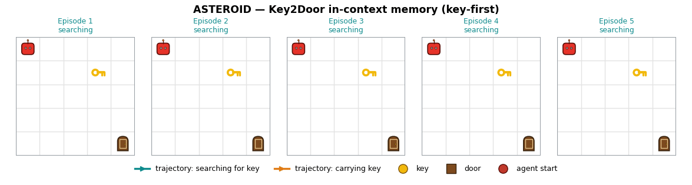
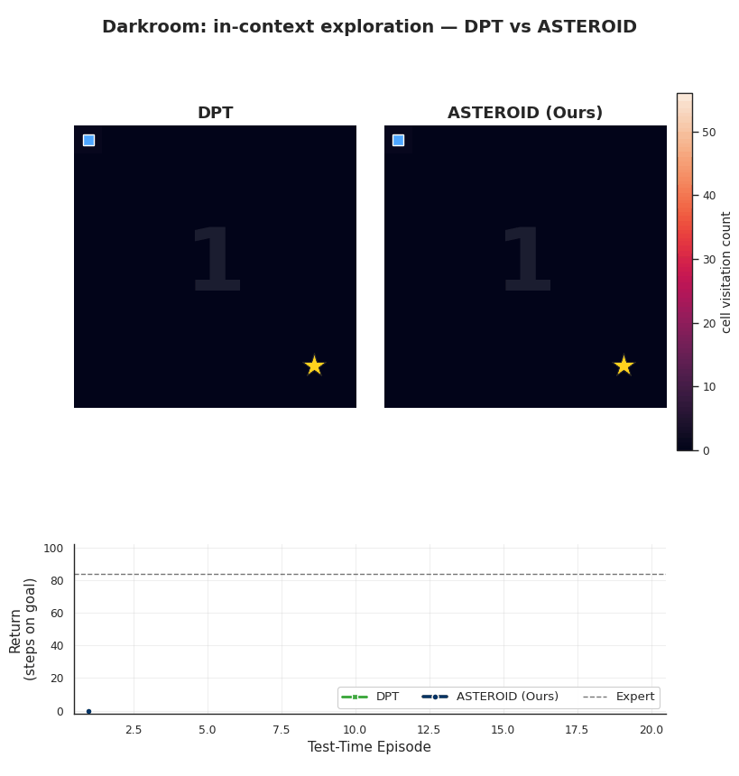
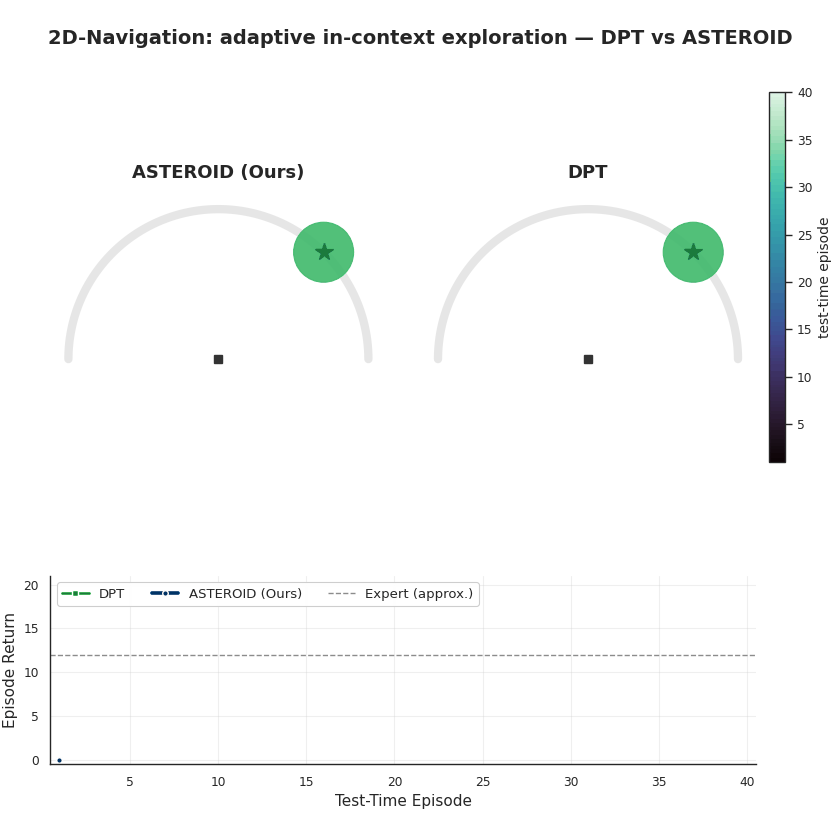

# ASTEROID: Asymmetric On-Policy Distillation Learns In-Context Exploration

[](https://arxiv.org/abs/PLACEHOLDER)
[](https://sites.google.com/view/icl-exploration)

Official implementation of **ASTEROID** (**A**symmetric **S**tudent–**Te**acher **R**oll**o**ut
**I**n-context **D**istillation), a simple framework for learning **in-context exploration**
in partially observed decision-making tasks from a privileged expert.

> Sequential decision-making under partial observability requires an agent to *explore* to infer
> hidden, task-relevant information before acting. Learning such behavior tabula rasa with RL is
> sample-inefficient, while offline imitation of a clairvoyant expert never demonstrates
> exploration. ASTEROID resolves this via iterative on-policy asymmetric distillation: the student
> collects on-policy context under partial observability, and the privileged expert labels actions
> conditioned on that context. As the context grows, the student learns to infer the hidden task
> from its own history and act accordingly — recovering Bayesian-posterior-sampling-like
> exploration while keeping the simplicity of supervised learning.

In-context exploration learned by ASTEROID at test time (vs. the offline DPT baseline):

<p align="center">
  
</p>
<p align="center"><em>Key2Door — the agent finds the key, remembers its location from context, and solves faster each episode (27 → 8 steps).</em></p>

<p align="center">
  
  
</p>
<p align="center"><em>Left: Darkroom cell-visitation over 20 episodes — DPT searches diffusely and never reaches the corner goal, while ASTEROID sweeps then locks on and jumps to the expert return. Right: 2D-Navigation — ASTEROID fans out and converges on the hidden goal; DPT explores near-randomly (paper Fig. 17 style).</em></p>

---

## Method

ASTEROID trains a history-conditioned Decision Transformer by alternating two phases per iteration
(Algorithm 1 in the paper):

1. **Data generation.** Roll out the current student under partial observability to collect
   on-policy histories, then query the clairvoyant expert for the optimal action at each state.
   The rollout horizon grows by one episode per iteration (a *context-length curriculum*).
2. **Supervised learning.** Train the student by conditional imitation of the expert labels on the
   accumulated dataset.

This on-policy relabeling gives coverage over exactly the histories the student visits at
deployment, so it learns to explore without the expert ever demonstrating exploration.

---

## Installation

The project uses [`uv`](https://docs.astral.sh/uv/). The core environment (ASTEROID + the DPT and
AAWR baselines) is a single command:

```bash
uv sync
```

Optional benchmarks/baselines are installed as extras:

```bash
uv sync --extra baselines   # RL2 (recurrent-PPO meta-RL)
uv sync --extra procgen     # Procgen maze benchmark
uv sync --all-extras        # everything
```

All commands below can be prefixed with `uv run` (e.g. `uv run python experiments/train_asteroid.py ...`).

---

## Repository structure

```
configs/         per-environment hyperparameter presets (YAML)
datasets/        trajectory dataset + on-policy data collection
environments/    gridworld/navigation/procgen envs, factory, rollout policies
models/          Decision Transformer (+ CNN), DPT transformer, asymmetric critic
experiments/     training and evaluation launchers
scripts/         sweep launchers and plotting helpers
results/         all checkpoints, evaluations, and logs (git-ignored)
```

**Environments:** `darkroom-easy`, `darkroom-hard`, `keydoor-markovian`, `keydoor-nonmarkovian`,
`navigation-episodic`, `navigation-nonepisodic`, and the Procgen maze.

---

## Training ASTEROID

Run with a per-environment config preset (any flag overrides the config):

```bash
uv run python experiments/train_asteroid.py --config configs/darkroom-easy.yaml --seed 0
```

Or specify arguments directly:

```bash
uv run python experiments/train_asteroid.py \
    --env_name keydoor-nonmarkovian \
    --dagger_steps 5 \
    --dataset_size 10000 \
    --num_epochs 100 \
    --eval_episodes 40 \
    --seed 0 --log_wandb
```

Sweep over environments and seeds:

```bash
ENVS="darkroom-easy darkroom-hard" SEEDS="0 1 2" bash scripts/train_asteroid.sh
```

### Outputs

Every method writes to `results/<method>/<exp_name>-<env>-seed<seed>/` with a common layout:

```
results/asteroid/asteroid-darkroom-easy-seed0/
├── model_args.pkl          # model config
├── final_model.pth         # final checkpoint
├── dagger_step_<k>/        # per-iteration checkpoints + train/test data
│   ├── model_epoch_*.pth
│   └── eval/               # eval_returns.npz, eval_returns.png, eval_trajs.pkl
```

Evaluate a trained checkpoint on held-out tasks:

```bash
uv run python experiments/eval_policy.py \
    --env_name darkroom-easy \
    --checkpoint_path results/asteroid/asteroid-darkroom-easy-seed0/dagger_step_4 \
    --plot_returns
```

---

## Baselines

All baselines share the same environments, dataset, and `results/` layout as ASTEROID.

### DPT (offline in-context pretraining)

Trains a Decision Transformer on offline random-context interactions labelled by the expert
(no on-policy iterations).

```bash
uv run python experiments/train_dpt.py --config configs/darkroom-easy.yaml --seed 0
```

### AAWR (asymmetric advantage-weighted regression)

Learns a privileged critic (IQL) then extracts a policy via advantage-weighted imitation.

```bash
uv run python experiments/train_aawr.py --config configs/darkroom-easy.yaml --seed 0
```

### RL2 (recurrent-PPO meta-RL) — requires `--extra baselines`

```bash
uv sync --extra baselines
uv run python experiments/train_rl2.py --env_name darkroom-easy --seed 0
```

Sweep the gridworld baselines together:

```bash
METHODS="dpt aawr rl2" ENVS="darkroom-easy" SEEDS="0 1 2" bash scripts/run_baselines.sh
```

### Procgen maze — requires `--extra procgen`

```bash
uv sync --extra procgen

# ASTEROID (CNN Decision Transformer) on procgen mazes
uv run python experiments/train_asteroid_procgen.py --seed 0

# Baselines: privileged expert eval, DPT eval (from checkpoint), BC+PPO
uv run python experiments/eval_procgen_expert.py --seed 0
uv run python experiments/eval_procgen_dpt.py --checkpoint <path.pt> --seed 0
uv run python experiments/train_procgen_bc_ppo.py --seed 0

# or the full sweep:
SEEDS="0 1 2" bash scripts/run_procgen.sh
```

---

## Citation

```bibtex
@article{poddar2026asteroid,
  title   = {Asymmetric On-Policy Distillation Learns In-Context Exploration},
  author  = {Poddar, Sriyash and Bao, Yanda and Krantz, Jacob and Chang, Matthew and
             Puig, Xavier and Mottaghi, Roozbeh and Jaques, Natasha and Gupta, Abhishek},
  journal = {arXiv preprint arXiv:PLACEHOLDER},
  year    = {2026}
}
```
